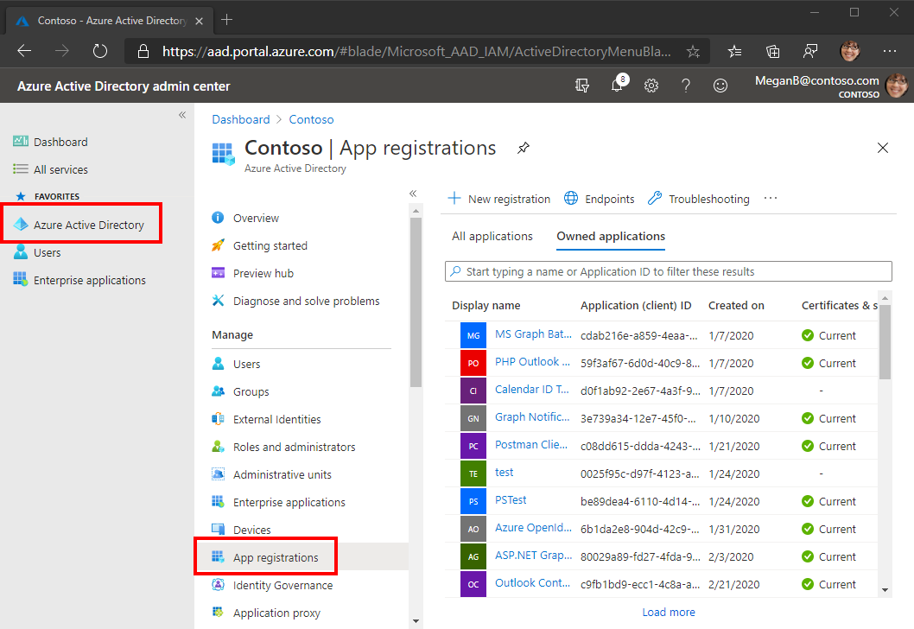

<!-- markdownlint-disable MD002 MD041 -->

この演習では、Azure Active Directory 管理センターを使用AD新しい Azure AD Web アプリケーションの登録を作成します。In this exercise, you will create a new Azure AD web application registration using the Azure Active Directory admin center.

1. ブラウザーを開き、[Azure Active Directory 管理センター](https://aad.portal.azure.com)へ移動します。Open a browser and navigate to the [Azure Active Directory admin center](https://aad.portal.azure.com). **個人用アカウント** (別名: Microsoft アカウント)、または **職場/学校アカウント** を使用してログインします。Login using a **personal account** (aka: Microsoft Account) or **Work or School Account**.

1. 左側のナビゲーションで **[Azure Active Directory]** を選択し、それから **[管理]** で **[アプリの登録]** を選択します。Select **Azure Active Directory** in the left-hand navigation, then select **App registrations** under **Manage**.

    

1. **[新規登録]** を選択します。Select **New registration**. [ **アプリケーションの登録]** ページで、前のセクションでコピーした ngrok 転送 URL を次のように `YOUR_NGROK_URL` 設定します。On the **Register an application** page, set the values as follows, where `YOUR_NGROK_URL` is the ngrok forwarding URL you copied in the previous section.

    - `Teams Graph Tutorial` に **[名前]** を設定します。Set **Name** to `Teams Graph Tutorial`.
    - **[サポートされているアカウントの種類]** を **[任意の組織のディレクトリ内のアカウントと個人用の Microsoft アカウント]** に設定します。Set **Supported account types** to **Accounts in any organizational directory and personal Microsoft accounts**.
    - **[リダイレクト URI]** で、最初のドロップダウン リストを `Web` に設定し、それから `YOUR_NGROK_URL/authcomplete` に値を設定します。Under **Redirect URI**, set the first drop-down to `Web` and set the value to `YOUR_NGROK_URL/authcomplete`.

    ![[アプリケーションを登録する] ページのスクリーンショット](./images/aad-register-an-app.png)

1. **[登録]** を選択します。Select **Register**. **[Teams Graph チュートリアル**] ページで、アプリケーション **(クライアント) ID** の値をコピーして保存します。次の手順で必要になります。On the **Teams Graph Tutorial** page, copy the value of the **Application (client) ID** and save it, you will need it in the next step.

    

1. **[管理]** の下の **[認証]** を選択します。Select **Authentication** under **Manage**. 暗黙的な許可 **セクションを見つけて**、アクセス トークンと ID **トークン\*\*\*\*を有効にします**。Locate the **Implicit grant** section and enable **Access tokens** and **ID tokens**. **[保存]** を選択します。Select **Save**.

1. **[管理]** で **[証明書とシークレット]** を選択します。Select **Certificates & secrets** under **Manage**. 
            \*\*[新しいクライアント シークレット]** ボタンを選択します。Select the **New client secret** button. **[説明]** に値を入力して、**[有効期限]** のオプションのいずれかを選び、**[追加]** を選択します。Enter a value in **Description** and select one of the options for **Expires** and select **Add**.

1. クライアント シークレットの値をコピーしてから、このページから移動します。Copy the client secret value before you leave this page. 次の手順で行います。You will need it in the next step.

    > [!IMPORTANT]
    > このクライアント シークレットは今後表示されないため、今必ずコピーするようにしてください。This client secret is never shown again, so make sure you copy it now.

1. [管理 **] で [API のアクセス** 許可 **] を選択し**、[アクセス許可の **追加] を選択します**。Select **API permissions** under **Manage**, then select **Add a permission**.

1. **[Microsoft Graph] を選択** し、[**委任されたアクセス許可] を選択します**。Select **Microsoft Graph**, then **Delegated permissions**.

1. 次のアクセス許可を選択し、[アクセス許可の追加 **] を選択します**。Select the following permissions, then select **Add permissions**.

    - **Calendars.ReadWrite** - これにより、アプリはユーザーの予定表を読み書きできます。**Calendars.ReadWrite** - this will allow the app to read and write to the user's calendar.
    - **MailboxSettings.Read** - これにより、アプリはメールボックス設定からユーザーのタイム ゾーン、日付形式、時刻形式を取得できます。**MailboxSettings.Read** - this will allow the app to get the user's time zone, date format, and time format from their mailbox settings.

    

## Teams シングル サインオンを構成するConfigure Teams single sign-on

このセクションでは、Teams でのシングル サインオンをサポートするためにアプリ [の登録を更新します](/microsoftteams/platform/tabs/how-to/authentication/auth-aad-sso)。In this section you'll update the app registration to support [single sign-on in Teams](/microsoftteams/platform/tabs/how-to/authentication/auth-aad-sso).

1. [API **の公開] を選択します**。Select **Expose an API**. [アプリケーション ID **URI]** の横にある [ **設定] リンクを選択します**。Select the **Set** link next to **Application ID URI**. 二重スラッシュと GUID の間に ngrok 転送 URL ドメイン名 (末尾にスラッシュ "/" が付加された名前) を挿入します。Insert your ngrok forwarding URL domain name (with a forward slash "/" appended to the end) between the double forward slashes and the GUID. ID 全体は次のように表示されます `api://50153897dd4d.ngrok.io/ae7d8088-3422-4c8c-a351-6ded0f21d615` 。The entire ID should look similar to: `api://50153897dd4d.ngrok.io/ae7d8088-3422-4c8c-a351-6ded0f21d615`.

1. [この **API で定義されているスコープ** ] セクションで、[スコープの追加 **] を選択します**。In the **Scopes defined by this API** section, select **Add a scope**. フィールドに次のように入力し、[範囲の追加 **] を選択します**。Fill in the fields as follows and select **Add scope**.

    - **スコープ名:**`access_as_user`**Scope name:** `access_as_user`
    - **同意できるユーザー: 管理者とユーザー****Who can consent?: Admins and users**
    - **管理者の同意の表示名:**`Access the app as the user`**Admin consent display name:** `Access the app as the user`
    - **管理者の同意の説明:**`Allows Teams to call the app's web APIs as the current user.`**Admin consent description:** `Allows Teams to call the app's web APIs as the current user.`
    - **ユーザーの同意の表示名:**`Access the app as you`**User consent display name:** `Access the app as you`
    - **ユーザーの同意の説明:**`Allows Teams to call the app's web APIs as you.`**User consent description:** `Allows Teams to call the app's web APIs as you.`
    - **状態: 有効****State: Enabled**

    ![[範囲の追加] フォームのスクリーンショット](images/aad-add-scope.png)

1. [承認済み **クライアント アプリケーション] セクションで** 、[クライアント アプリケーションの **追加] を選択します**。In the **Authorized client applications** section, select **Add a client application**. 次の一覧からクライアント ID を入力し、[承認済みスコープ] の下のスコープを有効にして、[アプリケーションの追加]**を選択します**。Enter a client ID from the following list, enable the scope under **Authorized scopes**, and select **Add application**. リスト内の各クライアント ID に対してこのプロセスを繰り返します。Repeat this process for each of the client IDs in the list.

    - `1fec8e78-bce4-4aaf-ab1b-5451cc387264` (Teams モバイル/デスクトップ アプリケーション)`1fec8e78-bce4-4aaf-ab1b-5451cc387264` (Teams mobile/desktop application)
    - `5e3ce6c0-2b1f-4285-8d4b-75ee78787346` (Teams Web アプリケーション)`5e3ce6c0-2b1f-4285-8d4b-75ee78787346` (Teams web application)
